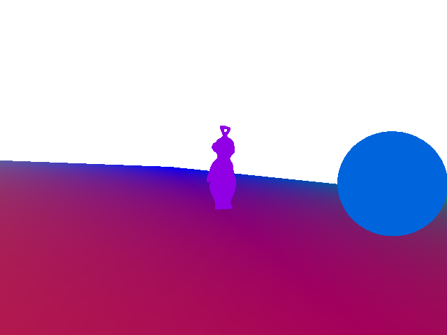
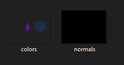
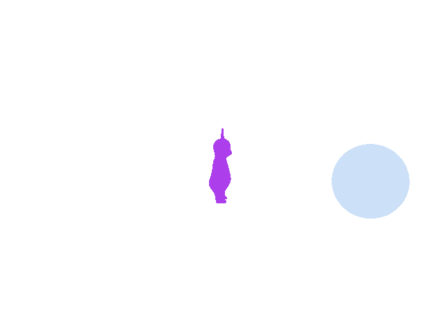
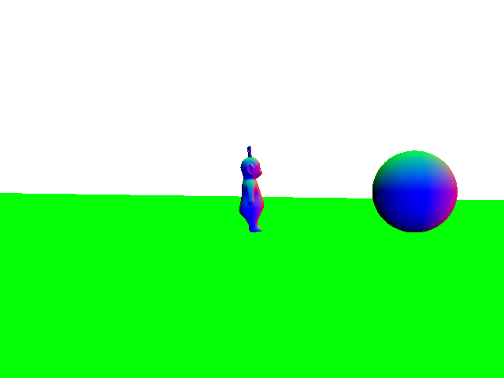
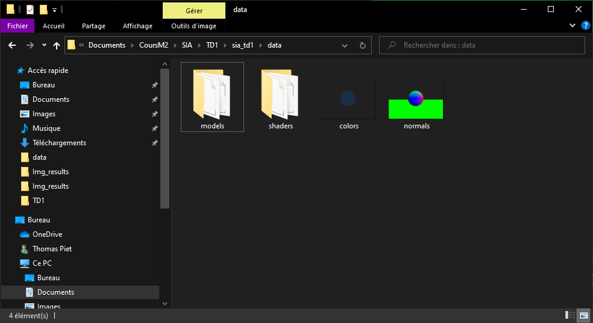

# 
 Rendu Synthèse d'Image Avancée   TD1 - Deferred shading

 ## 1. Creation et remplissage du g-buffer

    J'ai donc suivi pour la première partie les points du sujet. J'ai d'abord obtenu des résultats faux, comme le montre l'image suivante correspondant aux normals : 
    

    Le problème était donc au niveau de mes shaders. Après quelques modifications j'obtiens enfin des résultats correct, mais un nouveau problème se pose : je n'arrive pas à save les deux couches colors et normals en même temps.

    L'erreur était donc au nivau du FBO et de la fonction glFramebufferTexture2D(), et plus précisement du paramètre attachment, où j'utilisais pour les deux textures GL_COLOR_ATTACHMENT0 au lieu d'utilise pour l'une des deux GL_COLOR_ATTACHMENT1.
    Au final j'obtiens des textures colors et normals correctes.

Colors texture             |  Normals texture
:-------------------------:|:-------------------------:
   |  

## 2. Calcul de l'éclairage

    Pour cette seconde partie, après avoir suivi le sujet pour les deux premier point, je me suis retouvé avec un problème. Le code compile sans message d'erreur, le programme save bien deux png des texture colors et normals, mais il se termine instantanémnt sans rien afficher dans la fenêtre.

    Après quelques minutes, le problème était au niveau de la déclaration de inv_projection_matrix, que je déclarais en Matrix3f au lieu de Matrix4f. Maintenant le programme ne crash plus.

    J'ai donc essayé de faire le troisième point (code commenté) mais je n'ai réussi à obtenir qu'une fenêtre d'affichage noir.

