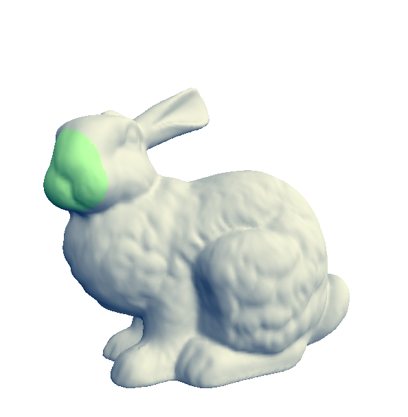

# 
 Rendu Synthèse d'Image Avancée   TD3 - Interpolation et déformation poly-harmonique

 ## 1. Prise en main

    L'objectif de ce TD est de mettre en oeuvre une méthode d'éléments finis pour la résolution de l'équation de Laplace sur un maillage triangulaire.

## 2. Création de la matrice Laplacienne

    La fonction create_laplacian_matrix permet la création de la matrix laplacienne pour tout le maillage. Pour ça, on modifie la fonction reate_laplacian_matrix().

## 3. Création de la matrice Laplacienne

    Cette partie consiste à isoler les inconnues, et pour ça il faut réordonner les équations et les sommets. Pour ça, on modifie la fonction create_permutation().

## 4. Création de la matrice Laplacienne

    Pour cette partie, on résoud l'équation 4, en utilisant la factorisation de Cholesky.
    Après cetet partie, il devrait nous être possible de tester la reconstruction, pour ça on sélectionne un zone :

    Puis on appuie sur 1 pour lancer l'application. Hélas, ici le programme tourne, semble bugger un peu, puis à la fin aucun changement.
