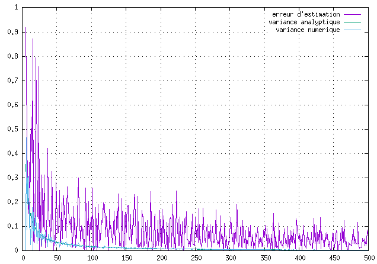
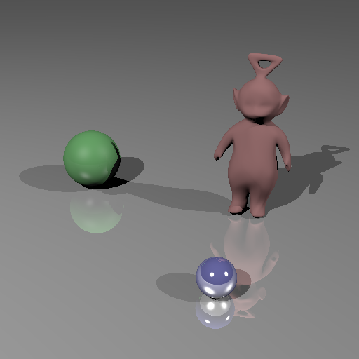
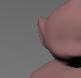
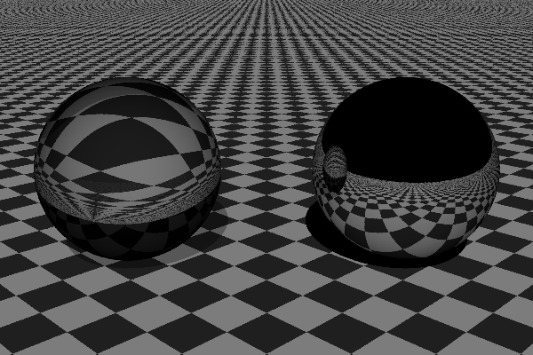
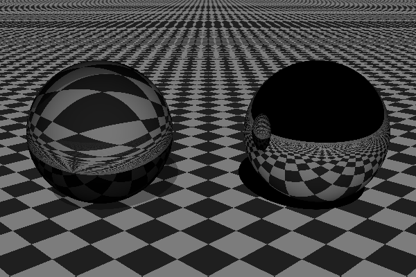
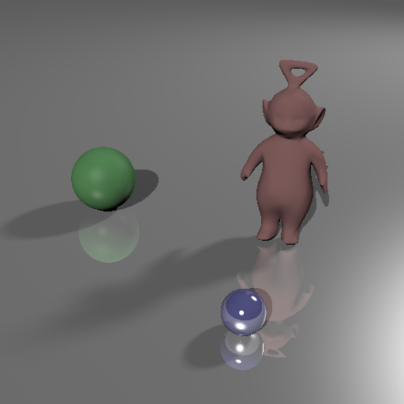

# 
 Rendu Synthèse d'Image Avancée   TD4 - Echantillonnage

 ## 1. Intégration Monte Carlo

    Pour cette première partie j'ai donc commencé par implémenter la fonction int_mc. 
    On commence par implémenter la fonction int_mc().
    Puis on calcul la variance analytique : pour ce calcul j'ai choisis de mettre directement (16/9) / n, car je l'ai calculé à l'avance avec les a et b donné dans le code (a = 0 et b = 1).
    On ajoute ensuite la variance numérique (varest de la fonction int_mc).

    On affiche ensuite l'erreur d'estimation, la variance analytique et la variance numérique:
    

## 2. Anti-Aliasing

### 2.1 Echnatillonnage régulier

    Pour cette partie, on échantillonne le pixel en une grille de n * n, où n correspond à l'attribut sampleCount de la caméra.

    On obtient ça avec "tw.scn" en fixant le nombre d'échantillons à 8 dans le fichier scène :

### 2.2 Echnatillonnage stratifié

    Pour cette partie on fait un échantillonnage de façon stratifié en ajoutant du jitter à chaque rayon. On obtiens donc ces résultats : 

2x2            |  8x8
:-------------------------:|:-------------------------:
   |  

   |  
:-------------------------:|:-------------------------:
32x32            |  128x128

## 3. Sources étendues

### 3.1 Echnatillonnage de Monte-Carlo

    Pour cette partie, on modifie whitted.cpp pour modifier le comportement des lumières dans AreaLight.
    On obtiens ce résultat :

### 3.2 Source texturée

