# <center> Rendu Synthèse d'Image Avancée <br> TD5 - BRDF de Ward

 ## 1. Éclairage direct

    Avant de commencer, j'ai eu quelques soucis. Codant sous Windows j'ai eu des problèmes d'include pour glah.h dans common.cpp et khrplatform.h dans glad.h. Je n'avais jamais eu ce problème dans les autres TDs pourtant. La seule solution que j'ai trouvé est donc de modifier le chemin et mettre le chemin entier. Il faudra donc peut être commenter ces lignes et remettre celles d'origine pour pouvoir compiler.
    
    Pour cette partie, j'ai retranscrit la formule donnée.
    J'ai du inverser m_alphaX et m_alphaY dans les calcul de hx et hy, car le résultat semblait inversé par rapport à ce qui était attendu.

    J'obtiens donc ces résultats : 

$\alpha$<sub>x</sub> = $\alpha$<sub>y</sub> = 0.01  |   $\alpha$<sub>x</sub> = $\alpha$<sub>y</sub> = 0.1  | $\alpha$<sub>x</sub> = $\alpha$<sub>y</sub> = 0.25   |   $\alpha$<sub>x</sub> = $\alpha$<sub>y</sub> = 0.5
:-------------------------:|:-------------------------:|:-------------------------:|:-------------------------:
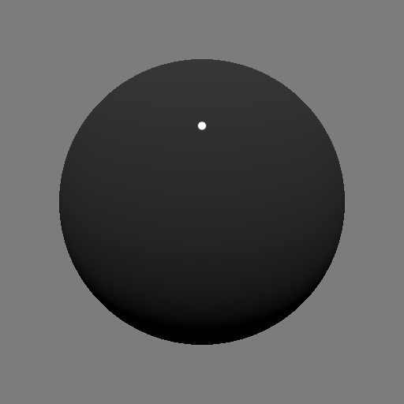   |      |  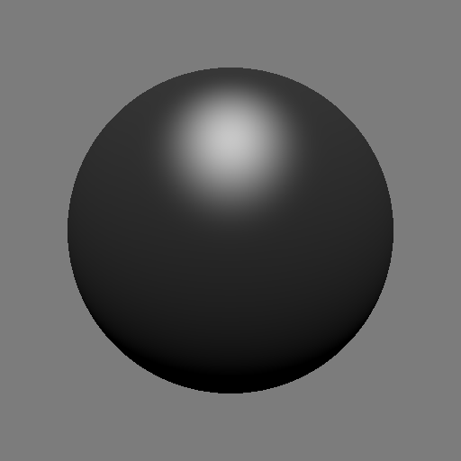  |  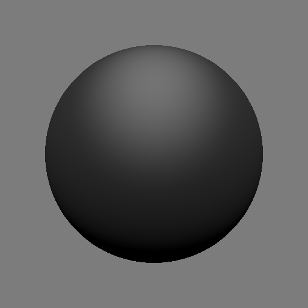

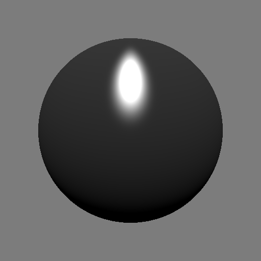   |  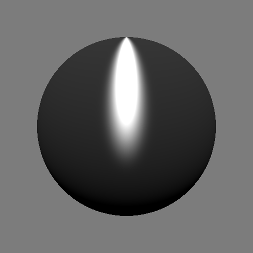    |    |  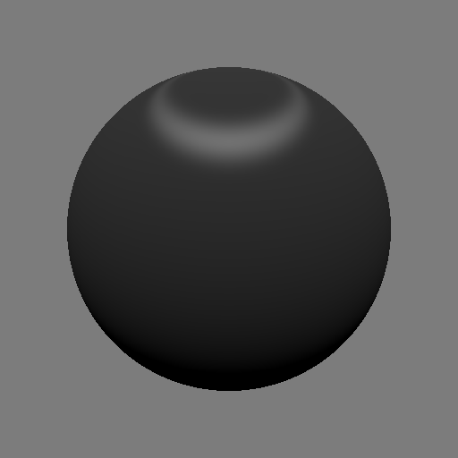
:-------------------------:|:-------------------------:|:-------------------------:|:-------------------------:
$\alpha$<sub>x</sub> = 0.2  $\alpha$<sub>y</sub> = 0.1  |   $\alpha$<sub>x</sub> = 0.5  $\alpha$<sub>y</sub> = 0.1  | $\alpha$<sub>x</sub> = 0.1  $\alpha$<sub>y</sub> = 0.2    |   $\alpha$<sub>x</sub> = 0.1  $\alpha$<sub>y</sub> = 0.5


## 2. Échantillonnage uniforme de la BRDF

    Pour cette partie j'ai commencé par faire le fichier directs_mats.cpp. Pour implémentez l'intégrateur DirectMats, on s'inspire de Whitted en replançant la réflexion miroir par un échantillonnage uniforme de la BRDF. Pour cela j'appelle la fonction Material::us() pour récuperer une direction aléatoire que j'attribue à la pdf. Je calcule finalement la radiance à l'aide de la brdf, le cosinus et la couleur du background.

$\alpha$<sub>x</sub> = $\alpha$<sub>y</sub> = 0.01  |   $\alpha$<sub>x</sub> = $\alpha$<sub>y</sub> = 0.1
:-------------------------:|:-------------------------:
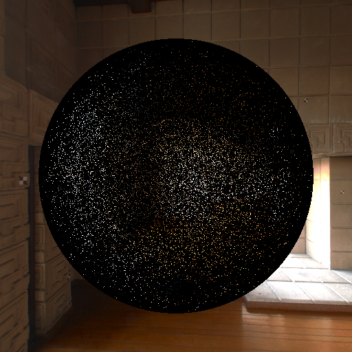   |  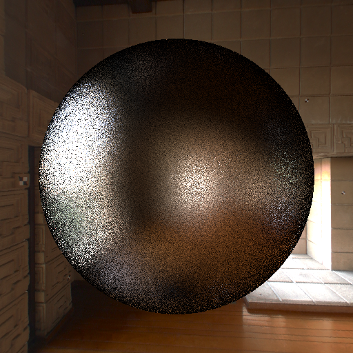

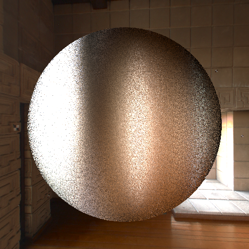   |  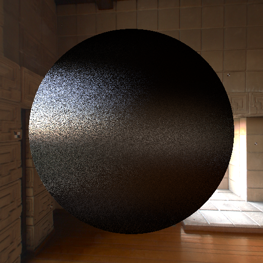
:-------------------------:|:-------------------------:
$\alpha$<sub>x</sub> = 0.5  $\alpha$<sub>y</sub> = 0.1  |   $\alpha$<sub>x</sub> = 0.1  $\alpha$<sub>y</sub> = 0.5


## 3. Échantillonnage préférentiel

    Je commence donc par implémenter une méthode d'importance sampling. Pour cela j'utilise les équations données :

```cpp
Vector3f Ward::is(const Normal3f& n, const Vector3f &i, float& pdf) const
{
    float u = Eigen::internal::random<float>(0,1);
    float v = Eigen::internal::random<float>(0,1);

    Vector3f x = Vector3f(0,1,0) - Vector3f(0,1,0).dot(n)*n;
    x.normalize();
    Vector3f y = n.cross(x);

    float phi_h = atanf((m_alphaY / m_alphaX) * tanf(2 * M_PI * v));

    float thetha_h = atanf(sqrtf(-logf(u) / (pow(cosf(phi_h),2) / pow(m_alphaX,2)) + (pow(sinf(phi_h),2) / pow(m_alphaY,2))));

    Vector3f h = sinf(thetha_h) * cosf(phi_h) * x + sinf(thetha_h) * sinf(phi_h) * y + cosf(thetha_h) * n;

    Vector3f o = 2 * i.dot(h) * h - i;

    return o;
}

```

    Je continue ensuite avec al fonction Viewer::drawContents. Puis je crée une méthode Ward::premultBrdf, avec l'équation donnée. JE remplace brdf par premultBrdf dans DirecMats::Li.

    J'obtiens ça : 

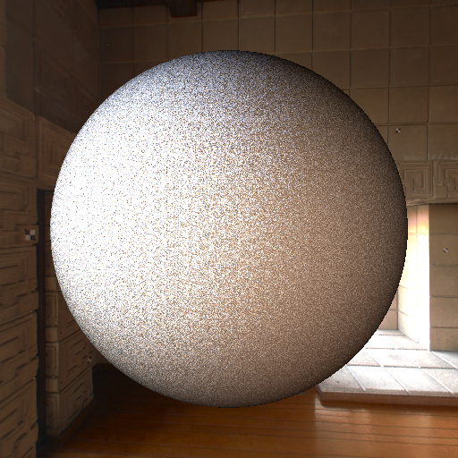

    Je pense que le problème viens en partie du fait que je n'ai pas fait la méthode Diffuse::is() mais Ward::is, car je n'arrivais pas à obtenir m_alphaX et m_alphaY dans materiel.cpp.
    


