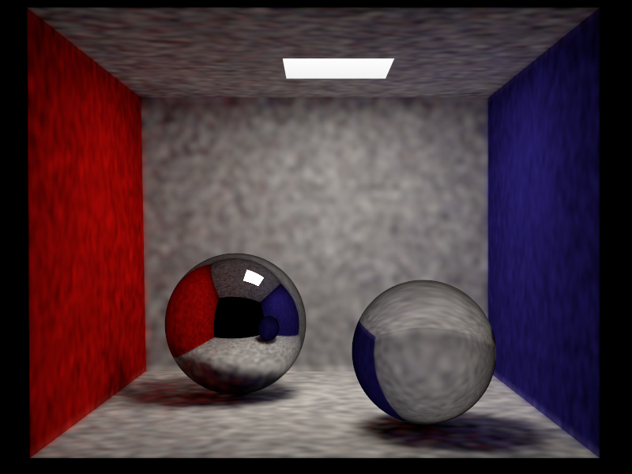

# 
 Rendu Synthèse d'Image Avancée   TD7 - Photon Mapping

 ## 1. Émission et tracé des photons

    J'ai commencé par implémenter les fonctions samplePhoton des classes Scene et AreaLight.
    Pour la première j'ai délectionner une source aléatoire et j'ai ensuite appelé la seconde. Pour la seconde, j'ai pris une position aléatoire, puis une direction aléatoire et enfin j'ai implémenter l'équation PI * A * Le.
    Ensuite j'ai réalisé la fonction preprocess correspondant à la première passe de l'algorithme.

## 2. Estimation de la radiance

    Cette deuxième partie consiste à réaliser la deuxième passe. On utilise la fonction PathMats::Li comme point de départ.

  
 

    Le programme semble avoir un problème sous Windows (je n'ai pas pu le lancer sous Linux), car parfois il crash quand je change les paramètre dans le fichier scn. De plus parfois il fonctionne avec les paramètres par défaut et parfois non. Je n'ai pas trouvé d'où celà pourrais venir.
